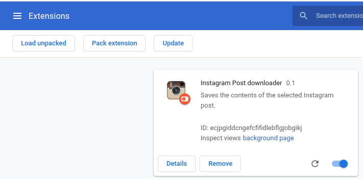

# Background

A few weeks ago, it was announced that [hundreds of Instagram Chrome extensions were infected with malware](https://press.avast.com/third-party-browser-extensions-from-instagram-facebook-vimeo-and-others-infected-with-malware). The specific downloader I used was on that list, and so, left with no other option, I decided to write my own.

# About

This is a Chrome extension for downloading Instagram posts. You can download normal posts, reels, or videos.

# Installation

1. Go to the main Chrome Extensions page: chrome://extensions/

2. Click "Load unpacked"

3. Point to the directory where you cloned this repo.

# Usage/Features

Navigate to a specific Instagram post's page, e.g: `https://www.instagram.com/p/CKW1c2PLbq2/` then click the "Instagram Post Downloader" in your browser actions toolbar.

Supports all kinds of Instagram posts, videos, and reels.

Downloaded images/video contain the following in the filename:

1. The uploader's username
2. The date the post was uploaded
3. The date the post was downloaded

# Feature Wishlist

- [ ] Add support for downloading stories
- [ ] Add support for downloading story highlights
- [ ] Include post metadata (caption, author, date uploaded) as part of the EXIF data in the highlighted image
